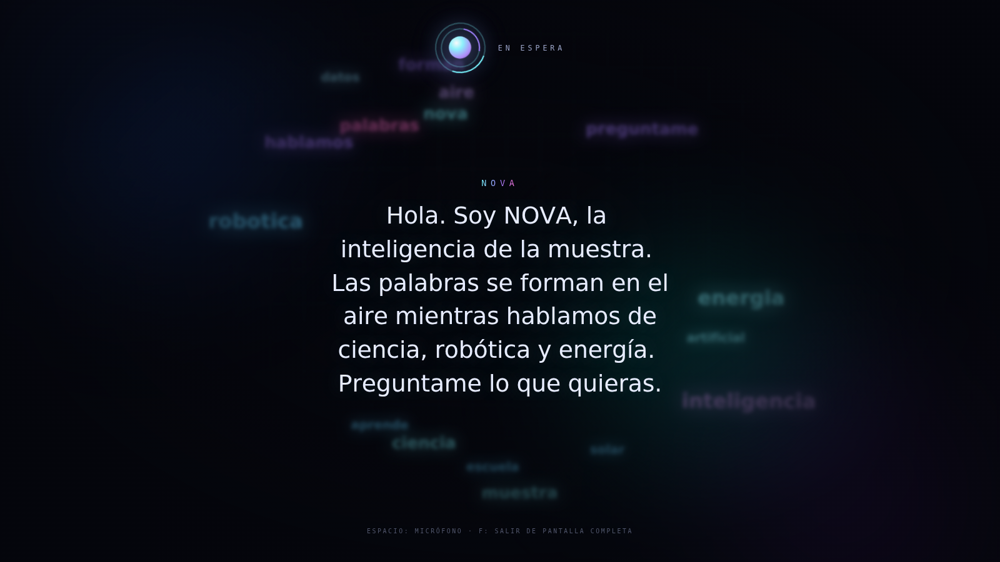

# NOVA · IASTEM

Interfaz conversacional para proyectar en pantalla gigante. El público le habla,
NOVA responde por la API de ChatGPT, y las letras **se materializan en el aire**
mientras una nube de palabras va dibujando los temas de la charla.



---

## Qué hace

| | |
|---|---|
| **Letras estilo Jumanji** | Cada carácter entra como un glifo extraño que muta hasta encontrar su forma. |
| **Nube de palabras** | Las palabras importantes de la conversación flotan de fondo, crecen si se repiten y se disuelven solas. |
| **Voz en vivo** | Micrófono continuo: el público habla, NOVA escucha, piensa y contesta (opcionalmente en voz alta). |
| **Dos vistas** | *Consola* para operar y *Escenario* a pantalla completa para proyectar. |
| **La clave, a salvo** | La API key vive en el servidor. El navegador nunca la ve. |

## Puesta en marcha

Necesitás [Node.js 18 o superior](https://nodejs.org).

```bash
# 1. Conseguí una API key en https://platform.openai.com/api-keys
# 2. Configurá el proyecto
cp .env.example .env
#    abrí .env y pegá tu clave en OPENAI_API_KEY

# 3. Arrancá
npm start
```

Abrí **http://localhost:3000** y listo. No hay que instalar dependencias: el
servidor usa solo lo que ya trae Node.

> **Ojo con la API key:** es privada y tiene costo por uso. El archivo `.env`
> está ignorado por git, así que no se sube al repo. Nunca la pegues en el
> código del navegador.

## Cómo se usa

| Acción | Cómo |
|---|---|
| Hablarle | Botón del micrófono, o **barra espaciadora** |
| Escribirle | Campo de texto, **Enter** para enviar |
| Proyectar | Botón *Modo escenario*, o tecla **F** |
| Volver | **Esc** |
| Cortar una respuesta | Botón *Detener*, o **Esc** mientras responde |
| Que NOVA hable en voz alta | Interruptor *Voz de NOVA* |
| Empezar de cero | Botón *Limpiar* |

Cuando el micrófono está encendido, NOVA espera **1,4 segundos de silencio**
antes de contestar: así un grupo puede hablar en varias frases sin que la
respuesta se dispare a mitad de la idea.

## Para la muestra

Unas cuantas cosas que conviene tener resueltas antes de proyectar:

- **Usá Chrome o Edge.** Son los que reconocen voz. Firefox no lo soporta y el
  micrófono aparece deshabilitado (el chat escrito sigue andando).
- **El micrófono necesita `localhost` o HTTPS.** Si corrés todo en la
  computadora de la presentación, `http://localhost:3000` alcanza. Si servís
  desde otra máquina de la red, el navegador va a bloquear el micrófono salvo
  que uses HTTPS.
- **Dale permiso al micrófono antes de empezar**, con el público todavía
  entrando: el cartelito del navegador arruina cualquier apertura.
- **Probá el audio de la sala.** Si vas a usar *Voz de NOVA* con parlantes,
  el micrófono se pausa solo mientras habla para no escucharse a sí misma,
  pero conviene ensayarlo igual.
- **Ajustá la personalidad** desde `SYSTEM_PROMPT` en el `.env`: ahí definís
  cómo se presenta NOVA y en qué tono responde. Para un público escolar,
  pedile respuestas cortas.
- **Un modelo rápido se siente mejor en vivo.** `gpt-4o-mini` responde casi al
  instante; los modelos más grandes se hacen esperar y en escenario se nota.

## Configuración

Todo se ajusta desde el `.env` (mirá `.env.example`):

| Variable | Para qué | Por defecto |
|---|---|---|
| `OPENAI_API_KEY` | Tu clave. **Obligatoria.** | — |
| `OPENAI_MODEL` | Qué modelo usar | `gpt-4o-mini` |
| `OPENAI_BASE_URL` | Endpoint compatible con OpenAI | `https://api.openai.com/v1` |
| `SYSTEM_PROMPT` | La personalidad de NOVA | NOVA en español rioplatense |
| `PORT` | Puerto del servidor | `3000` |

Como `OPENAI_BASE_URL` es configurable, esto también funciona contra cualquier
API compatible: Azure OpenAI, OpenRouter, Groq, o un modelo local con LM Studio
u Ollama.

## Cómo está armado

```
server.js              Servidor: archivos estáticos + proxy a la API (sin dependencias)
public/
  index.html           Las dos vistas: consola y escenario
  styles.css           Estética base: orbe, aurora, chat
  stage.css            Modo escenario y el efecto de letras
  app.js               Orquestador: une todas las piezas
  js/
    api.js             Cliente del streaming (SSE)
    materialize.js     El efecto Jumanji, letra por letra
    wordcloud.js       La nube de palabras en canvas
    voice.js           Micrófono y voz (Web Speech API)
```

El navegador nunca habla con OpenAI: le pide a `/api/chat` de este servidor, y
el servidor —el único que conoce la clave— reenvía el pedido y devuelve la
respuesta en streaming, fragmento por fragmento. Por eso las letras pueden
empezar a formarse antes de que la frase esté terminada.

## Ajustes finos

Si querés retocar el efecto para tu pantalla:

- **Velocidad de las letras** — `charsPerSecond` en `app.js` (`sceneWriter`).
  Más bajo es más dramático; más alto acompaña mejor a la voz.
- **Cuántas mutaciones** hace cada letra antes de fijarse — `mutations` en
  `materialize.js`.
- **Densidad de la nube** — `maxWords` en `wordcloud.js`.
- **Cuánto duran las palabras** — `decay` en `wordcloud.js` (más chico = duran más).
- **Palabras a ignorar** — la lista `STOPWORDS` en `wordcloud.js`.
- **Colores** — las variables `--cyan`, `--violet`, `--magenta` arriba de `styles.css`.
