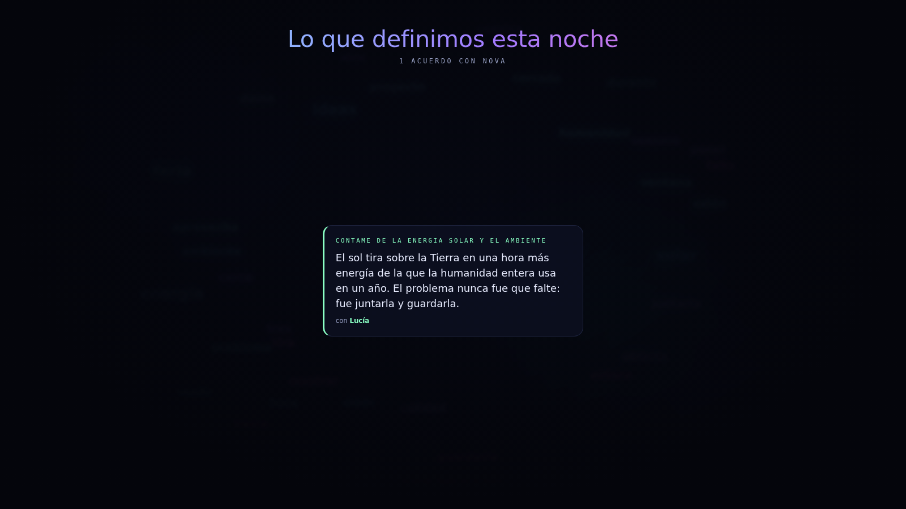

# NOVA · IASTEM

Sistema para una performance en vivo: los estudiantes conversan con una
inteligencia artificial frente al público, en pantalla gigante. Las letras **se
materializan en el aire**, la voz de quien habla mueve los visuales, y lo que el
grupo va definiendo junto a NOVA queda en un muro que se muestra al final.




---

## Probala ya

No hace falta configurar nada para verla funcionando:

```bash
npm start            # → http://localhost:3000
```

Sin clave configurada arranca en **modo demo**: NOVA contesta con un guion
guardado y todo lo demás —las letras, la nube, el micrófono, la voz— funciona
igual. Sirve para mostrar la página sin gastar un peso.

¿Ni siquiera querés instalar Node? Abrí **`demo/nova-demo.html`** con doble
clic. Es la misma página en un solo archivo, y anda sin internet.

## Qué hace

| | |
|---|---|
| **Letras estilo Jumanji** | Cada carácter entra como un glifo extraño que muta hasta encontrar su forma. |
| **Nube de palabras** | Las palabras importantes flotan de fondo, crecen si se repiten y se disuelven solas. |
| **Voz en vivo** | Micrófono continuo: el público habla, NOVA escucha, piensa y contesta en voz alta. |
| **La voz que se ve** | El volumen real de quien habla mueve el orbe y la nube: se nota que la IA lo está escuchando a él. |
| **Turnos** | Cada estudiante tiene nombre y color; la pantalla dice quién habla. |
| **Muro de acuerdos** | Lo que definen junto a NOVA queda fijado y se muestra todo junto al cierre. |
| **Dos vistas** | *Consola* para operar y *Escenario* a pantalla completa para proyectar. |
| **Modo demo** | Funciona sin API key, para mostrarla o ensayar. |

## De dónde salen las respuestas

La página se adapta sola a dónde esté corriendo. Hay tres situaciones, y la
diferencia entre ellas es **dónde vive la API key**:

| Modo | Cuándo | Dónde queda la clave |
|---|---|---|
| **Servidor local** | Corrés `npm start` con un `.env` configurado | En el servidor. El navegador nunca la ve. **La más segura.** |
| **Directo** | Sitio estático (GitHub Pages) con una clave cargada desde *Conexión* | En el navegador de esa computadora |
| **Demo** | No hay ni servidor ni clave | No hay clave |

El botón **Conexión** de arriba a la derecha muestra en cuál está y permite
cambiar de uno a otro.

### Con servidor local (recomendado para la muestra)

```bash
cp .env.example .env      # pegá tu clave en OPENAI_API_KEY
npm start
```

Conseguí la clave en [platform.openai.com/api-keys](https://platform.openai.com/api-keys).
El archivo `.env` está ignorado por git, así que no se sube al repo.

Para la muestra en sí, **esta es la opción que conviene**: la clave se queda en
la computadora de la presentación y nadie puede sacarla desde el navegador.

## Publicar en GitHub Pages

Ya está publicado y se actualiza solo: **cada push a la rama por defecto vuelve
a publicar el sitio**, sin que haya que tocar nada.

```
https://TU-USUARIO.github.io/IASTEM/
```

Pages sirve la raíz del repositorio, y la página vive en `public/`. Por eso hay
un `index.html` en la raíz que lleva ahí: entrás por la dirección de arriba y
caés en la app. La dirección final incluye `/public/`, que es feo pero funciona.

<details>
<summary>Si querés la dirección corta, sin el <code>/public/</code></summary>

Andá a **Settings → Pages → Source** y elegí **GitHub Actions**. Eso apaga el
publicado automático por rama, así que hay que reponer el workflow que lo
reemplaza: está en el historial de git.

```bash
git show HEAD~1:.github/workflows/pages.yml > .github/workflows/pages.yml
git add .github/workflows/pages.yml && git commit -m "Publicar Pages por Actions"
git push
```

Ese workflow publica `public/` directamente, así que el sitio queda en la raíz y
el `index.html` de redirección deja de usarse.

**No pongas los dos mecanismos a la vez.** Si Pages está en modo rama y además
hay un workflow publicando, los dos despliegan en cada push y gana el que
termine último: el sitio queda impredecible.

</details>

### Leé esto antes de publicar

GitHub Pages sirve **archivos estáticos**: no puede correr el servidor Node, así
que ahí no hay dónde esconder una clave. Esto tiene tres consecuencias:

1. **El sitio publicado arranca en modo demo.** Cualquiera que entre ve la
   página funcionando con el guion guardado, sin consumir tu cuenta. Está bien
   que sea así.

2. **Para que piense de verdad hay que cargar la clave desde el botón
   *Conexión*.** Queda guardada en ese navegador, en esa computadora, y viaja
   únicamente a OpenAI. Hacelo antes de la muestra, en la máquina que vas a
   proyectar; no en el momento y delante de todos.

3. **Nunca escribas la clave en el código.** Si el repositorio es público, la
   clave queda expuesta apenas la subas y cualquiera puede gastar tu crédito.
   OpenAI escanea GitHub y suele revocar las claves que encuentra, pero no
   cuentes con que llegue a tiempo. Ponele además un límite de gasto a la clave
   desde el panel de OpenAI.

> Si querés un sitio público que responda de verdad sin exponer la clave,
> hace falta un intermediario que la guarde: una función serverless en
> Cloudflare Workers, Vercel o similar. El `server.js` de este repo ya hace
> exactamente ese trabajo y se adapta con pocos cambios.

## Cómo se usa

| Acción | Cómo |
|---|---|
| Hablarle | Botón del micrófono, o **barra espaciadora** |
| Escribirle | Campo de texto, **Enter** para enviar |
| Proyectar | Botón *Modo escenario*, o tecla **F** |
| Volver | **Esc** |
| Cortar una respuesta | Botón *Detener*, o **Esc** mientras responde |
| Silenciar a NOVA | Interruptor *Voz de NOVA* (viene encendida) |
| Empezar de cero | Botón *Limpiar* |

Con el micrófono encendido, NOVA espera **1,4 segundos de silencio** antes de
contestar: así un grupo puede hablar en varias frases sin que la respuesta se
dispare a mitad de la idea.

## Conducir la función

La página está pensada para una performance con estudiantes frente al público,
no para que alguien la use solo. Hay tres piezas para eso.

### Los turnos

En **Función → Quiénes participan** cargás a los estudiantes. Cada uno recibe un
color. Cuando le toca hablar, la pantalla grande muestra su nombre en ese color:
los padres siguen a su hijo, no a un cursor.

### Los acuerdos

Lo que el grupo va definiendo junto a NOVA se fija como tarjeta, con el nombre de
quien lo definió. Al final se muestran todos juntos en el **muro**, y eso es lo
que la gente se lleva de la noche.

De respuestas largas se guarda la primera parte, cortada al final de una frase:
una tarjeta tiene que leerse de lejos, un párrafo entero no.

### Las teclas

Todo se maneja sin mouse, que en vivo es lo que importa:

| Tecla | Qué hace |
|---|---|
| **Espacio** | Prende y apaga el micrófono |
| **1** … **9** | De quién es el turno |
| **Tab** | Pasa al siguiente estudiante |
| **A** | Fija la última respuesta en el muro |
| **M** | Muestra el muro completo, y vuelve |
| **P** | Muestra la portada, y vuelve |
| **F** | Entra y sale de pantalla completa |
| **Esc** | Corta la respuesta, o sale del escenario |

Una pregunta nueva vuelve sola a la charla, así que podés dejar el muro puesto
sin miedo a quedarte trabado ahí.

### La voz que se ve

Mientras el micrófono está abierto, el volumen real de quien habla mueve el orbe,
las barras y la nube de palabras. Nadie necesita que le expliquen que la IA está
escuchando a esa persona: se ve.

Si el navegador no deja abrir el micrófono dos veces a la vez, esto se apaga solo
y todo lo demás sigue funcionando.

### Todo se guarda

El plantel y los acuerdos quedan en el navegador. Si la máquina se reinicia a
mitad de la función, se recupera todo al recargar. Para empezar de cero, *Función
→ Borrar todos*.

## Para la muestra

- **Usá Chrome o Edge.** Son los que reconocen voz. En Firefox el micrófono
  aparece deshabilitado, pero el chat escrito anda igual.
- **El micrófono necesita HTTPS o `localhost`.** GitHub Pages es HTTPS, así que
  sirve. Si servís desde otra máquina de la red por HTTP, el navegador lo
  bloquea.
- **Dale permiso al micrófono con el público entrando**, no en el momento: el
  cartel del navegador arruina cualquier apertura.
- **Ensayá con los parlantes de la sala.** El micrófono se pausa solo mientras
  NOVA habla para no escucharse a sí misma, pero conviene probarlo.
- **Pedile respuestas cortas** desde *Conexión → Personalidad*. En pantalla
  gigante, un párrafo largo tarda en formarse y se pierde el efecto.
- **Un modelo rápido se siente mejor en vivo.** `gpt-4o-mini` responde casi al
  instante; los grandes se hacen esperar y en escenario se nota.
- **Ensayá en modo demo.** Podés probar toda la puesta en escena sin gastar
  nada, y recién conectar la clave el día de la muestra.
- **Cargá el plantel antes de empezar**, con los nombres como los van a
  escuchar los padres. Escribirlos en vivo se nota.
- **Arrancá en la portada** (tecla **P**) con la gente entrando, y cerrá con el
  muro (tecla **M**). Entre esas dos placas pasa la función.
- **Fijá pocos acuerdos y buenos.** Ocho tarjetas se leen; treinta no se lee
  ninguna.

## Cómo está armado

```
public/                  El sitio. Esto es lo que se publica en Pages.
  index.html             Las dos vistas: consola y escenario
  styles.css             Estética base: orbe, aurora, chat, panel de conexión
  stage.css              Modo escenario y el efecto de letras
  app.js                 Orquestador: une todas las piezas
  js/
    api.js               Elige de dónde salen las respuestas y lee el streaming
    materialize.js       El efecto Jumanji, letra por letra
    wordcloud.js         La nube de palabras en canvas
    voice.js             Micrófono y voz (Web Speech API)
    audio.js             Mide el volumen real: la voz que mueve los visuales
    show.js              La función: turnos de estudiantes y acuerdos
  demo/
    engine.js            Elige qué contesta NOVA en modo demo
    replies.json         El guion. Editalo, es texto plano.

index.html               Redirección a public/, para que Pages sirva la app
server.js                Servidor local: archivos estáticos + proxy a la API
demo/nova-demo.html      La página entera en un archivo, para doble clic
tools/build-demo.js      Genera ese archivo desde los de arriba
```

Con servidor, el navegador nunca habla con OpenAI: le pide a `/api/chat`, y el
servidor —el único que conoce la clave— reenvía y devuelve la respuesta en
streaming. Sin servidor, el navegador llama a OpenAI por su cuenta con la clave
que tenga guardada. En los dos casos la respuesta llega **de a fragmentos**, y
por eso las letras pueden empezar a formarse antes de que la frase termine.

Después de tocar algo en `public/`, regenerá el archivo suelto:

```bash
node tools/build-demo.js
```

## Ajustes finos

- **Velocidad de las letras** — `charsPerSecond` en `app.js` (`sceneWriter`).
  Más bajo es más dramático; más alto acompaña mejor a la voz.
- **Cuántas mutaciones** hace cada letra antes de fijarse — `mutations` en
  `materialize.js`.
- **Densidad de la nube** — `maxWords` en `wordcloud.js`.
- **Cuánto duran las palabras** — `decay` en `wordcloud.js` (más chico, duran más).
- **Palabras a ignorar** — la lista `STOPWORDS` en `wordcloud.js`.
- **Respuestas del modo demo** — `public/demo/replies.json`.
- **Colores** — las variables `--cyan`, `--violet`, `--magenta` arriba de `styles.css`.

## Variables del servidor local

Solo aplican a `npm start`; en Pages se configura todo desde *Conexión*.

| Variable | Para qué | Por defecto |
|---|---|---|
| `OPENAI_API_KEY` | Tu clave. Sin ella, arranca en modo demo. | — |
| `OPENAI_MODEL` | Qué modelo usar | `gpt-4o-mini` |
| `OPENAI_BASE_URL` | Endpoint compatible con OpenAI | `https://api.openai.com/v1` |
| `SYSTEM_PROMPT` | La personalidad de NOVA | NOVA en español rioplatense |
| `PORT` | Puerto del servidor | `3000` |
| `DEMO` | Poné `1` para forzar el modo demo aun con clave | — |

Como `OPENAI_BASE_URL` es configurable, el servidor también sirve contra
cualquier API compatible: Azure OpenAI, OpenRouter, Groq, o un modelo local con
LM Studio u Ollama.
